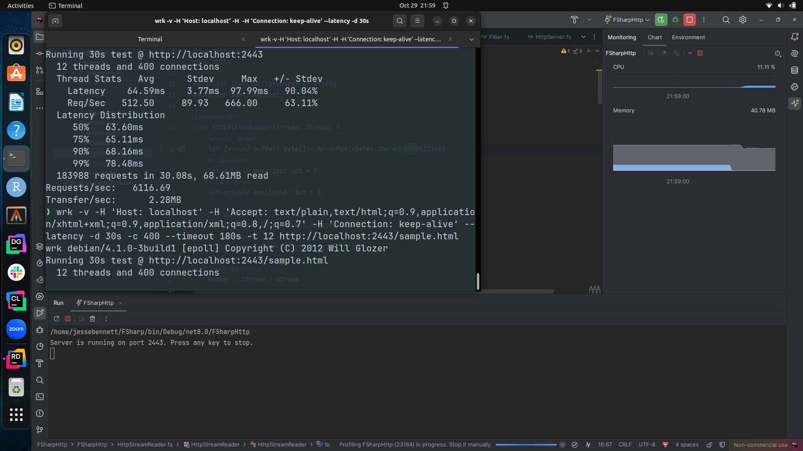

# FSharp
.Net Core FSharp Http Server based on miTLS

# Platform Info
Currently this works well on *Linux* only. Other platforms may have difficulties at this time. AOT only works on Linux. PRs are always welcome if somebody decides they want to improve the situation for other operating systems. It builds on FreeBSD but in order to get it back to normal all the async needs to be ripped out. On Windows the initial response time is very quick but some inherent connection limit will time out connections at some point. I have done no testing on MacOS. 

# Background
I'm using this repo to learn F# and FP. This is more of a concept than a specific application and will be a reference implementation for other work.

So what can I say after all this time so many things have changed? I decided it was worth actually making this work during the
hurricane milton.

This project has been updated to .Net Core 8

After getting the fibers to actually work I realized this web server's best traits are consistent and reliable
performance with a slim number of dependencies. TLS has been ripped out and do not think I will get back to
that. This is technically how an old fashion web server performs line by line. It is great for debugging clients.
Slamming this server should not slam the machine and performance could theoretically scale with the number schedulers.

Fibers ZIO experiment code was written by Bartosz Sypytkowski [https://bartoszsypytkowski.com/building-custom-fibers-library-in-f/]

I would like to point out that I in no way condone any of the fallout which occured with any aformentioned projects nor their
views. People are people, I cannot control them. This was developed before any of the lurid details spilled out into the
open obviously. 

miTLS original web server for miTLS-Flex [https://github.com/mitls/mitls-flex/tree/master/apps/HttpServer]

CoreRT experimental AOT runtime [https://github.com/dotnet/corert]

AOT has finally become a thing and this project has also transitioned to Native AOT deployment [https://learn.microsoft.com/en-us/dotnet/core/deploying/native-aot]

This now compiles in AOT mode with warnings so the project has trimming enabled. I am not sure what that is about but glad it actually builds and runs. Currently this produces a standalone binary ~5MB.

I've also decided to introduce Clojure's Atoms. So basically, since fibers currently work within the context of Interlocked.Exchange a Fiber can be thought of as an atomic coroutine. Atoms are Fibers and Fibers are Atoms in that sense.

The Closure implmentation can be found here: [https://www.fssnip.net/1V/title/Clojures-Atoms]

Not to be used in production this is an experiment....still

# Tuning

Currently, the initial buffer size is being adjusted. It has just been reduced to the bare minimum with plans to find some good middle-ground.

# Formal Methods

The scheduler has been formally verified using TapeDeck from which the Fiber scheduling was modeled. This puts the code through no less than 3 different compilation strategies:

# CODE -> Bosque -> Z3 -> C++ -> Rust

Although DateTime was not used as there is no facility for it in the gen 1 version of Bosque we can still treat this as an integer parameter. Modelling the lambdas and that they arrive in the designated order is as simple as this:

```
entrypoint function main(): Any {
    
    // Schedule task1 to run immediately
    let s = TestScheduler@new()
        .schedule(Func@enqueue(fn() => "R1"))
        .delay(8, Func@enqueue(fn() => "R2"))
        .delay(2, Func@enqueue(fn() => "R3"))
        .run();

    let currentTime = s.utcnow();
    
    check currentTime == s.now;

    check s.runlist.get(0).func.exe() == "R1";
    check s.runlist.get(1).func.exe() == "R3";
    check s.runlist.get(2).func.exe() == "R2";
    
    return [s.runlist, currentTime];
}

```

Values are captured from the lambda expressions in Bosque and we can also test for proper elision of nested lambda elements. This in turn proves that blocking works.
So for instance if you do this:

```
// Schedule task1 to run immediately
    let s = TestScheduler@new();
    let r1 = s.schedule(Func@enqueue(fn() => "R1")); 
    let r3 = r1.delay(2, Func@enqueue(fn() => {  
        let r2 = r1.delay(8, Func@enqueue(fn() => "R2"));
        return "R3"; }));
    let rr = r3.run();
```
Z3 will let us know that this does delete it effectively:

```
Symbolic testing of Bosque sources in files:
fibersched.bsq
...
Transpiling Bosque assembly to bytecode with entrypoint of NSMain::main...
Running z3 on SMT encoding...
(simplifier :num-exprs 2276 :num-asts 76849 :time 0.00 :before-memory 37.16 :after-memory 37.37)
(simplifier :num-exprs 2276 :num-asts 76690 :time 0.00 :before-memory 37.27 :after-memory 37.27)
(propagate-values :num-exprs 1782 :num-asts 76408 :time 0.00 :before-memory 37.27 :after-memory 37.86)
(ctx-simplify :num-steps 19025)
(ctx-simplify :num-exprs 1818 :num-asts 76505 :time 0.00 :before-memory 37.86 :after-memory 38.79)
(simplifier :num-exprs 1818 :num-asts 76489 :time 0.00 :before-memory 37.84 :after-memory 37.84)
(solve_eqs :num-exprs 81 :num-asts 76388 :time 0.00 :before-memory 37.84 :after-memory 37.84)
(:num-elim-vars 87)
(elim-uncnstr :num-exprs 81 :num-asts 76388 :time 0.00 :before-memory 37.84 :after-memory 37.84)
(simplifier :num-exprs 81 :num-asts 76388 :time 0.00 :before-memory 37.84 :after-memory 37.84)
(smt.tactic start)
(smt.propagate-values)
(smt.nnf-cnf)
(smt.reduce-asserted)
(smt.maximizing-bv-sharing)
(smt.reduce-asserted)
(smt.flatten-clauses)
(smt.simplifier-done)
(smt.searching)
(smt.stats :restarts     :decisions   :clauses/bin :simplify  :memory)
(smt.stats        :conflicts    :propagations :lemmas  :deletions   )
(smt.stats    0      0      0      0     0/0     0    0    0   39.07)
(smt :num-exprs 0 :num-asts 76342 :time 0.00 :before-memory 37.84 :after-memory 37.88)
sat
Detected possible errors!
Rerun with '-m' flag to attempt to generate failing inputs.
```
Other things TapeDeck can do is show things picked up normally by clang along with testing valid interop of values throughout Rust.
Here is an example of getting the IR to use less temporary values:

```
During:

Writing TapeDeck files...
warning: `/home/jbennett/tapedeck-player/.cargo/config` is deprecated in favor of `config.toml`
note: if you need to support cargo 1.38 or earlier, you can symlink `config` to `config.toml`
     Removed 50 files, 31.5MiB total
warning: `/home/jbennett/tapedeck-player/.cargo/config` is deprecated in favor of `config.toml`
note: if you need to support cargo 1.38 or earlier, you can symlink `config` to `config.toml`
   Compiling bsq v0.1.0 (/home/jbennett/tapedeck-player/bsq)
warning: bsq@0.1.0: In file included from src/lib.rs:7:
warning: bsq@0.1.0: In file included from src/bsqruntime.h:12:
warning: bsq@0.1.0: src/bsqcustom/bsqlist_ops.h:146:16: warning: use of bitwise '|' with boolean operands [-Wbitwise-instead-of-logical]
warning: bsq@0.1.0:             if((a == std::numeric_limits<int64_t>::max()) | (b == std::numeric_limits<int64_t>::max()))
warning: bsq@0.1.0:                ^~~~~~~~~~~~~~~~~~~~~~~~~~~~~~~~~~~~~~~~~~~~~~~~~~~~~~~~~~~~~~~~~~~~~~~~~~~~~~~~~~~~~~~
warning: bsq@0.1.0:                                                           ||
warning: bsq@0.1.0: src/bsqcustom/bsqlist_ops.h:146:16: note: cast one or both operands to int to silence this warning
warning: bsq@0.1.0: In file included from src/lib.rs:7:
warning: bsq@0.1.0: src/bsqruntime.h:677:23: warning: variable '_tmp_0I56I' set but not used [-Wunused-but-set-variable]
warning: bsq@0.1.0:     BSQBool $$return, _tmp_0I56I, _tmp_0_1I64I, ___ir_ret__I57I, ___ir_ret___1I65I, ___ir_ret___2I66I;
warning: bsq@0.1.0:                       ^
warning: bsq@0.1.0: src/bsqruntime.h:1093:142: warning: variable 'updatedtimelineI107I' set but not used [-Wunused-but-set-variable]
warning: bsq@0.1.0:     nscore__map_k_nscore__int__v_nscore__list_nsmain__func__I15I* _tmp_7I106I; nscore__map_k_nscore__int__v_nscore__list_nsmain__func__I15I* updatedtimelineI107I; nscore__map_k_nscore__int__v_nscore__list_nsmain__func__I15I* _tmp_10I108I; nscore__map_k_nscore__int__v_nscore__list_nsmain__func__I15I* _tmp_29I112I; nscore__map_k_nscore__int__v_nscore__list_nsmain__func__I15I* updatedtimeline_1I113I; nscore__map_k_nscore__int__v_nscore__list_nsmain__func__I15I* _tmp_17I114I; nscore__map_k_nscore__int__v_nscore__list_nsmain__func__I15I* _tmp_23I117I; nscore__map_k_nscore__int__v_nscore__list_nsmain__func__I15I* _tmp_13I122I; nscore__map_k_nscore__int__v_nscore__list_nsmain__func__I15I* updatedtimeline_2I123I; nscore__map_k_nscore__int__v_nscore__list_nsmain__func__I15I* _tmp_59I136I; nscore__map_k_nscore__int__v_nscore__list_nsmain__func__I15I* _tmp_56I140I; nscore__map_k_nscore__int__v_nscore__list_nsmain__func__I15I* _tmp_65I141I; nscore__map_k_nscore__int__v_nscore__list_nsmain__func__I15I* _tmp_71I144I; nscore__map_k_nscore__int__v_nscore__list_nsmain__func__I15I* _tmp_56_1I149I; nscore__map_k_nscore__int__v_nscore__list_nsmain__func__I15I* _tmp_56_2I150I;
warning: bsq@0.1.0:                                                                                                                                              ^
warning: bsq@0.1.0: src/bsqruntime.h:1093:378: warning: variable 'updatedtimeline_1I113I' set but not used [-Wunused-but-set-variable]
warning: bsq@0.1.0:     nscore__map_k_nscore__int__v_nscore__list_nsmain__func__I15I* _tmp_7I106I; nscore__map_k_nscore__int__v_nscore__list_nsmain__func__I15I* updatedtimelineI107I; nscore__map_k_nscore__int__v_nscore__list_nsmain__func__I15I* _tmp_10I108I; nscore__map_k_nscore__int__v_nscore__list_nsmain__func__I15I* _tmp_29I112I; nscore__map_k_nscore__int__v_nscore__list_nsmain__func__I15I* updatedtimeline_1I113I; nscore__map_k_nscore__int__v_nscore__list_nsmain__func__I15I* _tmp_17I114I; nscore__map_k_nscore__int__v_nscore__list_nsmain__func__I15I* _tmp_23I117I; nscore__map_k_nscore__int__v_nscore__list_nsmain__func__I15I* _tmp_13I122I; nscore__map_k_nscore__int__v_nscore__list_nsmain__func__I15I* updatedtimeline_2I123I; nscore__map_k_nscore__int__v_nscore__list_nsmain__func__I15I* _tmp_59I136I; nscore__map_k_nscore__int__v_nscore__list_nsmain__func__I15I* _tmp_56I140I; nscore__map_k_nscore__int__v_nscore__list_nsmain__func__I15I* _tmp_65I141I; nscore__map_k_nscore__int__v_nscore__list_nsmain__func__I15I* _tmp_71I144I; nscore__map_k_nscore__int__v_nscore__list_nsmain__func__I15I* _tmp_56_1I149I; nscore__map_k_nscore__int__v_nscore__list_nsmain__func__I15I* _tmp_56_2I150I;
warning: bsq@0.1.0:                                                                                                                                                                                                                                                                                                                                                                                          ^
warning: bsq@0.1.0: src/bsqruntime.h:1093:692: warning: variable 'updatedtimeline_2I123I' set but not used [-Wunused-but-set-variable]
warning: bsq@0.1.0:     nscore__map_k_nscore__int__v_nscore__list_nsmain__func__I15I* _tmp_7I106I; nscore__map_k_nscore__int__v_nscore__list_nsmain__func__I15I* updatedtimelineI107I; nscore__map_k_nscore__int__v_nscore__list_nsmain__func__I15I* _tmp_10I108I; nscore__map_k_nscore__int__v_nscore__list_nsmain__func__I15I* _tmp_29I112I; nscore__map_k_nscore__int__v_nscore__list_nsmain__func__I15I* updatedtimeline_1I113I; nscore__map_k_nscore__int__v_nscore__list_nsmain__func__I15I* _tmp_17I114I; nscore__map_k_nscore__int__v_nscore__list_nsmain__func__I15I* _tmp_23I117I; nscore__map_k_nscore__int__v_nscore__list_nsmain__func__I15I* _tmp_13I122I; nscore__map_k_nscore__int__v_nscore__list_nsmain__func__I15I* updatedtimeline_2I123I; nscore__map_k_nscore__int__v_nscore__list_nsmain__func__I15I* _tmp_59I136I; nscore__map_k_nscore__int__v_nscore__list_nsmain__func__I15I* _tmp_56I140I; nscore__map_k_nscore__int__v_nscore__list_nsmain__func__I15I* _tmp_65I141I; nscore__map_k_nscore__int__v_nscore__list_nsmain__func__I15I* _tmp_71I144I; nscore__map_k_nscore__int__v_nscore__list_nsmain__func__I15I* _tmp_56_1I149I; nscore__map_k_nscore__int__v_nscore__list_nsmain__func__I15I* _tmp_56_2I150I;
warning: bsq@0.1.0:                                                                                                                                                                                                                                                                                                                                                                                                                                                                                                                                                                                                                                                                                                                    ^
warning: bsq@0.1.0: 5 warnings generated.
   Compiling tapedeck v0.1.0 (/home/jbennett/tapedeck-player/tapedeck)
    Finished `dev` profile [unoptimized + debuginfo] target(s) in 2.36s
     Running `/home/jbennett/tapedeck-player/target/debug/tapedeck`
Starting TapeDeck
{{func=NSMain::Func{ "R1" }, time=0}, {func=NSMain::Func{ "R3" }, time=2}, {func=NSMain::Func{ "R2" }, time=8}}
BSQ Finished Executing
Finished executing BSQ

After:

Writing TapeDeck files...
warning: `/home/jbennett/tapedeck-player/.cargo/config` is deprecated in favor of `config.toml`
note: if you need to support cargo 1.38 or earlier, you can symlink `config` to `config.toml`
     Removed 50 files, 31.5MiB total
warning: `/home/jbennett/tapedeck-player/.cargo/config` is deprecated in favor of `config.toml`
note: if you need to support cargo 1.38 or earlier, you can symlink `config` to `config.toml`
   Compiling bsq v0.1.0 (/home/jbennett/tapedeck-player/bsq)
warning: bsq@0.1.0: In file included from src/lib.rs:7:
warning: bsq@0.1.0: In file included from src/bsqruntime.h:12:
warning: bsq@0.1.0: src/bsqcustom/bsqlist_ops.h:146:16: warning: use of bitwise '|' with boolean operands [-Wbitwise-instead-of-logical]
warning: bsq@0.1.0:             if((a == std::numeric_limits<int64_t>::max()) | (b == std::numeric_limits<int64_t>::max()))
warning: bsq@0.1.0:                ^~~~~~~~~~~~~~~~~~~~~~~~~~~~~~~~~~~~~~~~~~~~~~~~~~~~~~~~~~~~~~~~~~~~~~~~~~~~~~~~~~~~~~~
warning: bsq@0.1.0:                                                           ||
warning: bsq@0.1.0: src/bsqcustom/bsqlist_ops.h:146:16: note: cast one or both operands to int to silence this warning
warning: bsq@0.1.0: In file included from src/lib.rs:7:
warning: bsq@0.1.0: src/bsqruntime.h:677:23: warning: variable '_tmp_0I56I' set but not used [-Wunused-but-set-variable]
warning: bsq@0.1.0:     BSQBool $$return, _tmp_0I56I, _tmp_0_1I64I, ___ir_ret__I57I, ___ir_ret___1I65I, ___ir_ret___2I66I;
warning: bsq@0.1.0:                       ^
warning: bsq@0.1.0: 2 warnings generated.
   Compiling tapedeck v0.1.0 (/home/jbennett/tapedeck-player/tapedeck)
    Finished `dev` profile [unoptimized + debuginfo] target(s) in 2.35s
     Running `/home/jbennett/tapedeck-player/target/debug/tapedeck`
Starting TapeDeck
{{func=NSMain::Func{ "R1" }, time=0}, {func=NSMain::Func{ "R3" }, time=2}, {func=NSMain::Func{ "R2" }, time=8}}
BSQ Finished Executing
```
Warnings are normal here we are proving an entire runtime not just a small snippet of code. Working with Z3 allows more optimizations to take place:

```
Before:
Symbolic testing of Bosque sources in files:
fibersched.bsq
...
Transpiling Bosque assembly to bytecode with entrypoint of NSMain::main...
Running z3 on SMT encoding...
Writing SMT output to "fibersched.smt2..."
(simplifier :num-exprs 2763 :num-asts 231732 :time 0.00 :before-memory 107.52 :after-memory 107.68)
(simplifier :num-exprs 2763 :num-asts 231537 :time 0.00 :before-memory 107.68 :after-memory 107.68)
(propagate-values :num-exprs 2350 :num-asts 231336 :time 0.00 :before-memory 107.68 :after-memory 109.30)
(ctx-simplify :num-steps 23851)
(ctx-simplify :num-exprs 2582 :num-asts 231899 :time 0.00 :before-memory 109.30 :after-memory 112.48)
(simplifier :num-exprs 2582 :num-asts 231741 :time 0.00 :before-memory 109.31 :after-memory 109.43)
(solve_eqs :num-exprs 1 :num-asts 231805 :time 0.00 :before-memory 109.30 :after-memory 109.30)
unsat
Verified up to bound -- no errors found!

During:
Symbolic testing of Bosque sources in files:
fibersched.bsq
...
Transpiling Bosque assembly to bytecode with entrypoint of NSMain::main...
Running z3 on SMT encoding...
Writing SMT output to "fibersched.smt2..."
(simplifier :num-exprs 2791 :num-asts 118454 :time 0.00 :before-memory 58.77 :after-memory 58.93)
(simplifier :num-exprs 2791 :num-asts 118264 :time 0.00 :before-memory 58.93 :after-memory 58.93)
(propagate-values :num-exprs 2372 :num-asts 118057 :time 0.00 :before-memory 58.93 :after-memory 59.69)
(ctx-simplify :num-steps 30834)
(ctx-simplify :num-exprs 2504 :num-asts 118527 :time 0.00 :before-memory 59.69 :after-memory 61.12)
(simplifier :num-exprs 2504 :num-asts 118365 :time 0.00 :before-memory 59.70 :after-memory 59.70)
(solve_eqs :num-exprs 1 :num-asts 118429 :time 0.00 :before-memory 59.70 :after-memory 59.70)
unsat
Verified up to bound -- no errors found!

After:
Symbolic testing of Bosque sources in files:
fibersched.bsq
...
Transpiling Bosque assembly to bytecode with entrypoint of NSMain::main...
Running z3 on SMT encoding...
Writing SMT output to "fibersched.smt2..."
(simplifier :num-exprs 2799 :num-asts 88662 :time 0.00 :before-memory 38.52 :after-memory 38.68)
(simplifier :num-exprs 2799 :num-asts 88472 :time 0.00 :before-memory 38.68 :after-memory 38.68)
(propagate-values :num-exprs 2380 :num-asts 88265 :time 0.00 :before-memory 38.68 :after-memory 39.44)
(ctx-simplify :num-steps 30870)
(ctx-simplify :num-exprs 2512 :num-asts 88751 :time 0.00 :before-memory 39.44 :after-memory 40.86)
(simplifier :num-exprs 2512 :num-asts 88574 :time 0.00 :before-memory 39.44 :after-memory 39.44)
(solve_eqs :num-exprs 1 :num-asts 88644 :time 0.00 :before-memory 39.44 :after-memory 39.44)
unsat
Verified up to bound -- no errors found!
```
So, basically the moral of the story here is that if you throw a large number of work units (or lambdas) into a system which immediately sorts them then the system is not solvable. If you have 1 million work units scheduled you are attempting to sort 1 million things but also bumping others in priority. In fact while sorting Z3 ran for ~12 hours and consumed over 32GB of RAM before I gave up and tried something else. The answer was a simple insertion sort which ensures that Fibers run as they are scheduled every time consistently. This has been implemented in the server now. The other part of the provable code just provides a run log or rather generates the list of lambdas as they come in for debugging purposes down the line.

The finished product is that the scheduler not only is even more functional in design but also simple to understand and visually appealing:

```FSharp
let insertTask delay fn =
            let at = currentTime + delay
            let newTask = { Time = at; Func = fn }

            // Partition the tasks into two lists: before and after the new task's time
            let tasksBefore, tasksAfter =
                List.partition (fun task -> task.Time <= at) sortedTasks

            // Insert the new task between tasksBefore and tasksAfter
            sortedTasks <- tasksBefore @ [ newTask ] @ tasksAfter
```

# Performance
Performance is not stellar but allocations are tiny. It is still doing file I/O with every call. If everything is working right you should see this:



The other part you cannot see (running on 11th gen Intel) for the sample page is this:

```
wrk -v -H 'Host: localhost' -H 'Accept: text/plain,text/html;q=0.9,application/xhtml+xml;q=0.9,application/xml;q=0.8,/;q=0.7' -H 'Connection: keep-alive' --latency -d 30s -c 400 --timeout 180s -t 12 http://localhost:2443/sample.html
wrk debian/4.1.0-3build1 [epoll] Copyright (C) 2012 Will Glozer
Running 30s test @ http://localhost:2443/sample.html
  12 threads and 400 connections
  Thread Stats   Avg      Stdev     Max   +/- Stdev
    Latency    72.87ms    7.44ms 121.59ms   92.20%
    Req/Sec   454.05     87.16   666.00     65.40%
  Latency Distribution
     50%   70.72ms
     75%   72.82ms
     90%   78.59ms
     99%  107.99ms
  162828 requests in 30.08s, 4.96GB read
Requests/sec:   5413.20
Transfer/sec:    168.78MB
```
I am fully aware that a typical C# .NET Core project with response caching turned on will do 800k-900k requests in that timeframe but it also uses 8x the CPU and 10x the memory. More explanations about this can be found here: [https://www.reddit.com/r/fsharp/comments/g64y9k/why_is_f_slower_than_c/]


